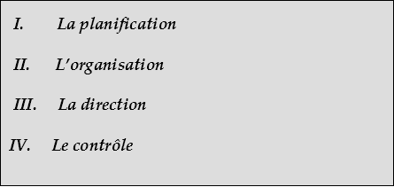
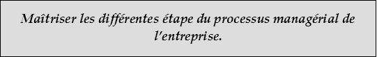
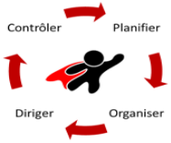
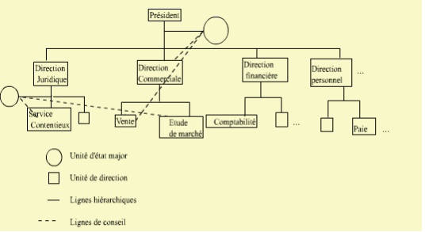
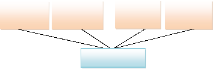
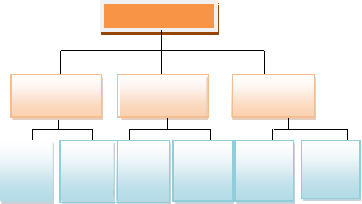
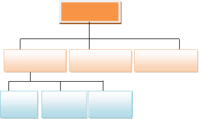
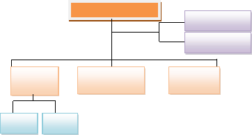
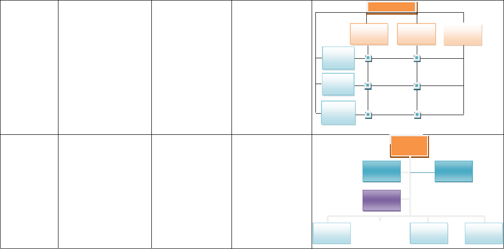
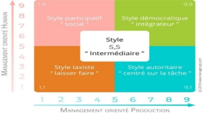



*CHAPITRE IV*

LE PROCESSUS DE MANAGEMENT

***PLAN :***

` `***I.        La planification***

` `***II.      L’organisation***

` `***III.     La direction***

***IV.     Le contrôle***

***OBJECTIF DU CHAPITRE:***

***Maîtriser les différentes étape du processus managérial de l’entreprise.***

Le Management est un processus par lequel des résultats sont obtenus de façon efficace et performante avec et via autrui. Il se décompose en 4 étapes : ***la planification, l’organisation, la direction et le contrôle:***

**SECTION I: La PLANIFICATION**

La planification constitue un acte essentiel du management, il permet à l’entreprise d’avoir des repères et de se positionner afin d’assurer la continuité de l’exploitation voire la survie en cas de turbulences.

1. **Définition :**

La planification est un processus qui consiste à fixer les objectifs, déterminer les moyens nécessaires pour la réalisation des ces objectifs et définir les étapes pour les atteindre. 

- *Utilité de la planification:*

La planification est très utile pour toute entreprise puisqu’elle permet de :

- Coordonner les activités de l’entreprise;
- Assurer que le futur est pris en considération : révèle les possibilités et les dangers futurs ;
- Agir sur le futur et le contrôler ;
- Avoir une meilleure visibilité financière ;
- Maîtriser son environnement en perpétuel changement.

1. **Les étapes de la planification**

La planification se réalise en 5 étapes principales : l’analyse SWOT, la définition des objectifs stratégiques, la conception d’un plan d’action stratégique, l’élaboration d’un plan opérationnel et la préparation des budgets ***(voir Annexe 1).***

**Etape1: Analyse de la position stratégique de l’entreprise: Analyse SWOT** 

L'analyse SWOT (Strengths Weaknesses Opportunités Threats ) ou FFOM (forces Faiblesses Opportunités Menaces) est un outil d'analyse stratégique. Il combine l'étude des forces et des faiblesses d'une organisation avec celle des opportunités et des menaces de son environnement. 

L’analyse SWOT se présente ainsi sous la forme de deux tableaux récapitulatifs :

- **Le Diagnostic Interne:** où on effectue l’analyse de l’entreprise en interne pour relever ses Forces et ses Faiblesses.

|**Forces**|**Faiblesses**|
| :-: | :-: |
|
Ce sont des facteurs internes qui donnent un avantage concurrentiel pour l’entreprise.

***Exemples***: *une marque prestigieuse, une importante propriété intellectuelle,une technologie supérieure, une équipe bien formée, l’expertise de la direction…*
|
Ce sont des facteurs internes négatifs qui peuvent se révéler néfastes pour l’organisation au regard de la concurrence et/ou qui peuvent être améliorés.

***Exemples:*** *des fournisseurs peu fiables, de l’équipement et de la machinerie désuets, du marketing insuffisant, du manque de financement, du manque d’expertise…*
|

- **Le Diagnostic Externe:** où on effectue l’analyse des opportunités et des menaces de l’environnement externe à l’entreprise.

|**Opportunités**|**Menaces**|
| :-: | :-: |
|
Qui sont des situations externes, propres à l’environnement dans lequel évolue l’entreprise et qui peuvent procurer un avantage concurrentiel à l’entreprise et sur lesquelles on peut s’appuyer.

***Exemples:*** *les nouveaux marchés potentiels, les innovations, les avancées technologiques, les tendances en matière de consummation, le soutien gouvernemental,…*
|
Qui sont des situations externes défavorables qui peuvent influencer négativement les performances de l’entreprise et détériorer sa position concurrentielle, ces facteurs peuvent être identifié

s au cours notemment de l’analyse du marché.

***Exemples:** une économie en déclin, les produits de substitution, un changement technologique,une pénurie de main d’oeuvre ou de MP, des changements législatifs ou réglementaires,…*
|

**Etape2: Définition des objectifs stratégiques**: 

Ils expriment la vision future de l’entreprise. Ces objectifs doivent être les résultats qu’on se propose d’atteindre dans des délais determinés 

**Etape3: Conception d’un plan d’action stratégique** (confrontation entre le diagnostic préparé et les objectifs): 

Il s’agit d’un plan qui permet de positionner l’activité globale de l’entreprise par rapport à son environnement.

**Etape4: Elaboration d’un plan opérationnel** (ou programmes d’action): 

C’est un complément indispensable de la planification stratégique, il permet la mise en œuvre du plan stratégique. La planification opérationnelle consiste à éclater les objectifs en sous objectifs spécifiques et à attribuer à chaque centre de responsabilité les sous objectifs que doivent réaliser, ainsi que le rôle et la responsabilité qu’il doit suivre dans la réalisation des objectifs globaux et la mise en œuvre de la stratégie retenue **(voir annexes 2 et 3)**.

**Etape5: Préparation des budgets**: 

Un budget consiste à chiffrer les plans d’action en dépenses et recettes prévisionnelles pour l’année à venir (budgets fonctionnels, budget des capitaux, budget des centres de responsabilité….).

**Remarque** : 

Bien que la planification est très avantageuse, elle a certaines limites telles que: le risque d’erreur ; le coût élevé, le retard de l’action, l’étouffement des initiatives…

**SECTION II: L’ORGANISATION**

1. **Définition** 

L’organisation de l’entreprise est le processus par lequel sont réparties les ressources, les responsabilités ainsi que les tâches entre les différents membres de l’organisation. Ainsi, l’organisation consiste à diviser le travail et préciser la nature des rapports de chaque individu avec les autres membres de l’entreprise permettant ainsi une clarification de l’autorité de chacun. Elle permet aussi à chaque responsable de prendre seulement les décisions qui relèvent de ses compétences et de connaître les limites de son autorité.

1. **La structure organisationnelle**

**II.1. La notion de structure**

La structure est :

- La segmentation de tâche en rôles tels que les rôles de production, finance, marketing, etc.
- La recombinaison des rôles en départements ou divisions en termes de fonctions, de produits, de régions ou de marchés.
- La distribution du pouvoir à l’intérieur de cette structure.

**II.2. Les éléments clés d’une structure organisationnelle**

1. **La départementalisation**
1. **:** la départementalisation signifie le regroupement des activités afin d’en garantir la coordination. Elle peut se faire par fonctions, par produits, par type de clients, par zone géographique…

1. **La spécialisation** : la départementalisation est suivie de l’attribution à chaque membre de l’entreprise d’une tâche étroite et limitée. Cependant, il faut éviter une spécialisation très poussée qui rend le travail routinier.

1. **La formalisation :** indique le degré d’explication dans la définition des règles de fonctionnement de l’entreprise. La formalisation permet de clarifier le fonctionnement de la structure, mais une formalisation excessive peut être source de rigidité.

1. **La chaîne hiérarchique:** ligne d’autorité continue qui court des échelons les plus élevés aux échelons les plus inférieurs, et qui clarifie les rapports de responsabilité des uns envers les autres.

1. **L’éventail de contrôle :** Nombre d’employés qu’un manager peut diriger de manière efficace sous sa responsabilité directe.

1. **Autorité, Responsabilité**

   0. *Autorité* **:** Droit inhérent à une position hiérarchique de donner des ordres et de les voir exécuter. On distingue *l’autorité hiérarchique* (donnée et définie par l'organisation) permettant à un supérieur de diriger le travail d'un employé et *l’autorité fonctionnelle* revenant à certains postes et devant permettre de décharger, d'assister et de conseiller les détenteurs d'autorité hiérarchique.
   0. *Responsabilité* **:** Obligation de réaliser des tâches assignées.

1. **La centralisation et la décentralisation :** La *centralisation*: consiste à remonter l’autorité de prendre les décisions au niveau supérieur de l’organisation. La *décentralisation*: consiste à déléguer la prise des décisions vers les niveaux inférieurs de l’organisation.

**II.3. Les composants d'une Structure**

1) **L’Organigramme:** C'est une représentation graphique de tous les liens existants entre les différents postes de travail ainsi que la nature des relations qu'ils entretiennent.

1) **Liaisons hiérarchiques:** Ce sont des liaisons classiques de chef à subordonné, des liaisons de commandement et d'autorité: Elles sont généralement verticales.

1) **Liaisons fonctionnelles:** Ce sont des liaisons d'entre aide, de conseil, de recommandations, sans aucune obligation d'exécution du travail. Ce sont des liaisons de spécialistes ayant l'autorité et le pouvoir de décision.

1) **Liaisons de conseil:** C'est la relation entre un cadre hiérarchique et un spécialiste, celui-ci n'ayant ni autorité sur le premier, ni pouvoir de décision.

1) **Organes différents:**

   **\* Opérationnels** ou d'exploitation (service de fabrication, de vente, de conception…);

   **\* Fonctionnels** qui assurent des activités de soutien aux services opérationnels (finance, comptabilité, gestion des ressources humaines…);

   **\* D'état major** qui conseillent et assistent les responsables dans la préparation de leurs décisions.

   

**II.3. Les déterminants d’une structure**

1. **La taille** : 

La petite entreprise a toujours une structure assez simple. Quand le nombre de salariés augmente, la coordination n’est plus spontanée et la nécessité de formalisation apparaît. Quand l’entreprise grandit, il devient nécessaire d’accroître sa spécialisation, d’accentuer la coordination et de formaliser. 

1. **La technologie** : 

Elle fait peser des contraintes fortes sur la définition d’une structure. Suivant son type de production, l’entreprise adoptera une structure mécaniste, centralisée et rigide, ou à l’inverse une structure organique, décentralisée et flexible. Donc si les tâches liées à la production sont répétitives, la centralisation pourra se développer. A l’inverse, si ces tâches sont peu répétitives, une décentralisation pourra se mettre en place.

1. **L’environnement** : 

Chaque entreprise doit choisir sa structure selon la nature de son environnement:

- Un environnement instable et incertain, exige une structure souple, reactive et flexible. 
- Un environnement stable, permet de choisir une structure simple voire même bureaucratique.
- Plus l’environnement est complexe, plus l’entreprise doit se spécialiser et se coordonner. 

En conséquence, l’entreprise doit évaluer les caractéristiques de son environnement pour mieux réagir à son impact…Le dynamisme, la complexité et l’incertitude de l’environnement vont modifier la structure de l’entreprise.

4. **La stratégie** : 

On entend par la stratégie, l’allocation des ressources humaines, techniques et financières par l’entreprise afin de réaliser des objectifs bien déterminés. 

Au moment de chaque nouvelle stratégie, il est primordial de faire une analyse de la structure de l’entreprise pour la renforcer, voire la changer, en cas de besoin, et ce pour accompagner l’exécution de la stratégie.

1. **Typologie des structures organisationnelles**

<table><tr><th colspan="1" valign="top">
<b>Type de</b>

<b>structure</b>
</th><th colspan="1" valign="top"><b>Description</b></th><th colspan="1" valign="top"><b>Avantages</b></th><th colspan="1" valign="top"><b>Inconvénients</b></th><th colspan="14" valign="top"><b>Illustrations</b></th></tr>
<tr><td colspan="1" valign="top">

<b>Structure hiérarchique</b>
</td><td colspan="1" valign="top">

C’est une structure fondée principalement sur le principe d’autorité, de hiérarchie et d’unicité de commandement.
</td><td colspan="1" valign="top">

-Une identification claire des responsabilités

-Une	discipline	et	un contrôle facilité

- Une clarté des relations hiérarchiques
</td><td colspan="1" valign="top">

-Une structure rigide en raison du poids de la hiérarchie.

- Difficultés de circulation de l’information entre les niveaux hiérarchiques.

-Initiative peu stimulée
</td><td colspan="14" valign="top">

<b>Direction</b>

<b>Direct.</b>approv	<b>Direct.	Direct.</b>

. Production

marketing	administrative

Service	Service	Service	Service	Service	Service Qualité	études			compta-

Achat	Publicité	Finance	bilité
</td></tr>
<tr><td colspan="1" rowspan="4" valign="top">

<b>Structure fonctionnelle</b>
</td><td colspan="1" rowspan="4" valign="top">chaque unité prend en charge un ensemble de tâches et de responsabilités différentes des autres unités. Chaque employé est spécialisé dans une tâche simple et répétitive.</td><td colspan="1" rowspan="6" valign="top">
-Une compétence accrue.

-Une initiative plus importante.

-La réalisation d’une économie d’échelle est facilitée en raison du regroupement	des ressources par spécialité<b>.</b>
</td><td colspan="1" rowspan="6" valign="top">
-Une dilution des responsabilités.

-Des difficultés pour résoudre les problèmes relevant de plusieurs domaines.

-Ralentissement	des décisions
</td><td colspan="5" valign="top"></td><td colspan="4" valign="top"><b>Directeur production</b></td><td colspan="5" valign="top"></td></tr>
<tr><td colspan="7" valign="top"></td><td colspan="7" valign="top"></td></tr>
<tr><td colspan="2" valign="top"></td><td colspan="2" valign="top"></td><td colspan="5" valign="top"></td><td colspan="3" valign="top"></td><td colspan="2" valign="top"></td></tr>
<tr><td colspan="1" rowspan="2" valign="top"></td><td colspan="2" valign="top">Responsable</td><td colspan="3" valign="top">Responsable</td><td colspan="2" rowspan="2" valign="top"></td><td colspan="2" valign="top">Responsabl e</td><td colspan="1" rowspan="2" valign="top"></td><td colspan="2" valign="top">Responsable</td><td colspan="1" rowspan="2" valign="top"></td></tr>
<tr><td colspan="1" valign="top"></td><td colspan="1" valign="top"></td><td colspan="2" valign="top">Qualité</td><td colspan="3" valign="top">Des méthodes</td><td colspan="2" valign="top"></td><td colspan="2" valign="top">Contrôle</td></tr>
<tr><td colspan="1" valign="top"></td><td colspan="1" valign="top"></td><td colspan="14" valign="top">

Ouvrier
</td></tr>
</table>

|

**Structure Staff and Line (Hiérarchico- fonctionnelle)**
|Le principe de ce type de structure est celui de la double ligne, une ligne dispose d’une autorité générale (pouvoir de commandement), une autre d’une autorité dans la spécialité (pouvoir de conseil).|
-Une meilleure connaissance des problèmes complexes.

-Le développement de relations fructueuses entre la direction et les staffs à travers un travail d’équipe
|
Le risque de conflits entre fonctionnels et opérationnels : Les uns étant	chargés d’effectuer des études et des analyses sans véritable pouvoir dans

l’application, les autres appliquent des idées qui ne viennent pas d’eux
||
**Direction générale**

Contrôleur de gestion Conseiller en marketing

Direction	Direction	Direction

comptabilité	marketing

Atelier	Atelier

1	2
|
| :- | - | :- | - | :- | :-: |
|

**Structure divisionnelle**
|Les divisions reposent le plus souvent sur des marchés, produits, clientèle, zone géographique. A l’intérieur de chaque division, on retrouve fréquemment une structure par fonctions|
-La motivation et la responsabilisation des responsables.

-Une structure décentralisée d’où un style de direction plus participatif.

-Une	plus	grande flexibilité et réactivité.
|
-Risque de conflits de priorités.

-Une dispersion des ressources entre divisions (perte d’économies d’échelle).

-Elle nécessite la polyvalence des dirigeants, ce qui n’est pas évident
||
**Le directeur général**

Chef département	Chef département	Chef département produit A	produit B	produit C

Direct.	Direct.	Direct.
|

**Structure matricielle**

C’est une structure complexe dont le principe consiste à maintenir des départements	par fonctions et d’y proposer des groupes opérationnels. Les membres de l’organisation sont donc rattachés à la fois à un département, en fonction de la spécialité et à une cellule opérationnelle en fonction du produit, de la région ou du projet sur lequel ils travaillent.

-Mieux s’adapter à l’environnement

-Mettre au service de l’ensemble	de

l’organisation	les compétences spécifiques des spécialistes.

-La formation et le développement	de l’expertise dans le cadre de travail en équipe.

-L’absence d’unité de commandement et l’ambiguïté des rôles

-Une structure coûteuse en personnel

-Un problème de l’équilibre de pouvoir entre les responsables.



Chef produit A

Chef produit B

Chef produit C



**Direction**

Direction	Direction

**Structure par projets**



La structure par projets organise l’entreprise dont l’activité a un caractère non répétitif (grands travaux,	ingénierie complexe…). Des équipes temporaires sont dédiées à un projet et dissoutes une fois qu’il est achevé



Cette structure permet au chef de projet d’organiser la mobilisation des moyens nécessaires à la réalisation du projet, de contrôler son déroulement et de résoudre les conflits inhérents



L’acquisition d’expérience est plus délicate	dans			une structure	par		projet que dans une activité répétitive,		car				les possibilités							de standardisation		sont faibles. Seuls les chefs de	projets		peuvent capitaliser					leur expérience



Projet1 Chef

deprojet



**R**

**&**

**Finance**



**D G**

Projet 2 Chef de



**Commercial**

Projet 3 Chef de

**SECTION III. LA DIRECTION**

La direction consiste à inciter et à motiver les membres d’un groupe à travailler ensemble pour accomplir des tâches liées les unes aux autres. Elle implique nécessairement  l’interaction entre les dirigeants et les membres du groupes afin d’atteindre les objectifs fixés. Et pour rendre plus efficace le système productif les responsables doivent intervenir pour contrôler le déroulement du travail.

1. **Le leadership**

**I.1. Définition**

Le leadership est l’action d’inspirer la conduite des autres (individus ou groupes) ou d’influencer sur celle-ci dans le but de les amener à réaliser avec enthousiasme des objectifs clairement définis.

Ainsi, Le leadership comporte deux dimensions :

0. La nécessité d’influencer les autres et de les convaincre d’accomplir le  travail requis ;
0. La réaction positive des subalternes qui acceptent d’effectuer leurs tâches parce que leur leader se montre sensible à leurs besoins et sait y répondre.

**I.2. Les fondements du pouvoir**

Le pouvoir traduit la capacité d’influer sur le comportement d’un individu ou d’un groupe. On distingue le pouvoir lié au poste occupé et le pouvoir personnel.

- ***Le pouvoir lié au poste du travail :***

  - `  `*Le pouvoir légitime* : Constitue l’autorité officielle que l’on accorde au titulaire d’un poste afin de lui permettre de diriger certaines personnes et de s’en faire obéir.

  - `  `*Le pouvoir de la récompense* : Est la capacité d’offrir quelque chose aux gens pour leur faire adopter une certaine conduite.

- *Le pouvoir coercitif* : Se rattache à la capacité d’un individu d’en punir d’autres, telle que la perçoivent ses subalternes. Un supérieur peut l’exercer en attribuant à  un subordonné des tâches déplaisantes, en le rétrogradant…

- ***Le pouvoir personnel :***

  - *Le pouvoir dû à la compétence :* il dénote la capacité d’influer sur la conduite d’autrui en faisant appel aux connaissances et à l’expertise technique ou professionnelle que l’on possède.

  - *Le pouvoir charismatique :* est lié à la capacité d’influencer les autres grâce à une forte personnalité et à l’admiration qu’on leur inspire. Il se manifeste, par exemple, lorsqu’un cadre débutant s’identifie à son supérieur et affirme qu’il souhaite devenir comme lui.

2. **Les styles de direction**

   C’est la façon dont le dirigeant va orienter l’action de son équipe.

   **II.1. Les styles de direction selon Blake et Mouton**

   En prenant en considération les deux critères suivants :

   0. l’importance qu’accorde le dirigeant à la production.
   0. l’importance qu’accorde le dirigeant aux individus.

      Blake et Mouton ont pu déterminer les cinq styles suivants :

   0. ***Le style 1,9* :** le manager cherche à satisfaire les individus au détriment des tâches de production.
   0. ***Le  style 1,1* :** le	responsable	ne s’intéresse qu’à l’application des procédures et des règles du métier.
   0. ***Le style 5,5* :** le manager cherche en général les compromis entre les nécessités opérationnelles et la satisfaction des aspirations des employés.
   0. ***Le style 9,9* :** les employés sont responsables et s’intéressent énormément au travail, ce qui permet un très bon suivi des tâches de production.
   0. ***Le style 9,1* :** les relations avec les subordonnés sont fondées sur l’autorité et l’obéissance, ces subordonnés exécutent seulement les ordres.

Chaque dirigeant peut ainsi :

- Se situer sur l'échiquier managérial ;
- Eviter la situation de style (1,1) car elle est une source de conflits ;
- Rechercher une voie moyenne de style (5,5).
- Tenter d'évoluer vers le style (9,9) = C'est le style idéal.

  **II.2.** **Les styles de direction selon Rensis Likert (voir chapitre 1)**

2. **Choix du style de direction**

Le choix du style de direction résulte de la confrontation de trois éléments:

- Système de valeur du dirigeant (ce en quoi il croit);
- L'attente des subordonnés (ce qu'attend le subordonné comme style de direction de son supérieur);
- Les caractéristiques de la situation (urgence et la nature des problèmes à traiter). 

  Deux grands styles, à degré variable, différencient les gestionnaires:

- Le style à dominante autoritaire,
- Le style à dominante participative.

2. **La motivation**

La motivation est un élément d’encouragement et d’incitation qui permet de mobiliser efficacement les efforts des membres de l’entreprise vers l’épanouissement. Les employés motivés s’avèrent plus productifs et souhaitent davantage contribuer à la réalisation des objectifs de leur organisation.

Les théories de la motivation, axées sur le contenu du travail tentent de répondre à une question fondamentale, à savoir : *quels sont les éléments qui incitent un individu à se comporter d’une certaine manière ?*

Ces théories mettent l’accent sur la compréhension :

- des besoins, des désirs et des motifs fondamentaux (pulsions internes), qui poussent les individus à accomplir une tâche particulière ;
- des mesures que les gestionnaires peuvent prendre dans le but de leur faire obtenir une récompense (éléments externes).

Les principales théories de motivation sont celle de ***la théorie des besoins de Maslow*** et ***la*** ***théorie des deux facteurs de Hertzberg***. ***(voir chapitre 1)***

**SECTION IV: LE CONTROLE**

1. **Définition et Objectif**

**Le contrôle peut être défini comme un processus qui permet au gestionnaire:**

- d'*évaluer* sa performance;
- de *comparer les résultats* obtenus à ses plans et à ses objectifs;
- de prendre les mesures appropriées pour *remédier* aux situations défavorables.

**L'objet du contrôle est donc:**

- de *mesurer* les résultats
- de jouer *un rôle de communication* (l'analyse des résultats doit être communiquée pour qu'elle soit efficace);
- de constituer *un facteur de motivation*.

1. **Le  déroulement du processus de contrôle**

Le processus de contrôle comprend cinq étapes principales :

|**Unités Organisationnelles**|**Service Commercial**|**Service Production**|**Service Entretien**|
| :- | :- | :- | :- |
|**Objectifs**|Etre plus actif sur le marché|Améliorer la qualité du produit|Réduire les charges|
|
**Etape 1:**

Identifier les critères de rendement
|
- Nombre d’unités vendues

- Nombre de clients visités par jour et par vendeur
|Taux de rejet en %|Charges d’entretien au m2|
|
**Etape 2:**

Fixer les norms de rendement
|
- 245 000

- 3 clients
|0,05%|0,750 DT|
|
**Etape 3:**

Evaluer les résultats
|
- 250 000

- 3 clients
|0,06%|0,700 DT|
|
**Etape 4:**

Evaluation des écarts entre le prévu et le réalisé
|

+ 5000
|

- 0,01%
|

+ 0,05 DT
|
|
**Etape 5:**

Appliquer les mesures necessaries pour corriger les situations défavorables

|A la suite de l’évaluation des écarts, tout écart positif est jugé comme une performance et tout écart negative doit donner lieu à une analyse approfondie pour une performance future.|||

Une norme est donc une référence à laquelle se référera le dirigeant chaque fois qu'il cherchera à évaluer ses résultats.

- La fixation des normes de rendement est importante à plus d'un niveau :
- La connaissance des normes par les employés est un facteur de motivation;
- Une norme juste et réalisable assure la validité du processus de contrôle;
- Des normes de rendement ni trop élevées ni trop faibles poussent les employés à devenir plus productifs;
- La connaissance du résultat de sa performance pousse l'employé à travailler beaucoup mieux avec un meilleur moral.

- Les critères de rendement sont bien choisis:

Ainsi, un gestionnaire peut choisir une mesure de rendement qui évalue les activités d'une unité et non son rendement.

***Exemple:***

*Le directeur des ventes peut évaluer le rendement de ses vendeurs en fonction du nombre de visites effectuées chez les clients: l'accent est alors mis sur le moyen utilisé (visites) et non sur les résultats visés (chiffre d'affaires réalisé).*

- Le nombre des critères choisi est restreint,

- Le choix des critères et la fixation des normes de rendement font participer les subalternes.

- Les critères de rendement ne sont pas uniformes dans toute l'entreprise: 

Ainsi, il faut établir les critères en fonction de chaque unité administrative.

***Exemple:***

*Le critère de rendement du service des ventes sera le nombre d'unités vendues ; pour celui du crédit, le critère sera le délai moyen de recouvrement…*

- La fréquence de l'évaluation du rendement n'est pas uniforme: 

Il serait important d'évaluer régulièrement la qualité des produits.

***Exemple:***

*Dans le service de production, il serait préférable de vérifier la qualité de la production à chaque heure alors que l'évaluation de la performance des représentants des ventes peut être mensuelle.*

- Les employés sont informés des résultats obtenus:

Il importe de communiquer aux employés le résultat du travail qu'ils ont accompli sinon ils continueront à ignorer leurs faiblesses et ne pourront pas prendre les mesures nécessaires pour améliorer la qualité de leur travail.

1. **Les différents types de contrôles**

Les activités de contrôle peuvent s’exercer à trois occasions par rapport à l’activité  visée :

- *Le contrôle proactif* : Il est généralement effectué avant l’accomplissement de l’activité, il s’agit d’un contrôle préventif tel que l’entretien d’une machine.

- *Le contrôle concomitant:* Ce type de contrôle est effectué pendant l’exécution de l’activité, lorsqu’un écart est décelé une correction est apportée immédiatement afin d’éviter la possibilité que l’erreur se répercute sur tout le processus.

- *Le contrôle rétroactif*: Il est effectué à la fin, c'est-à-dire une fois que l’activité est terminée. Tel contrôle sert pour faire des ajustements futurs, mais les mesures prises ne peuvent ni affecter ni changer les résultats déjà réalisés.

